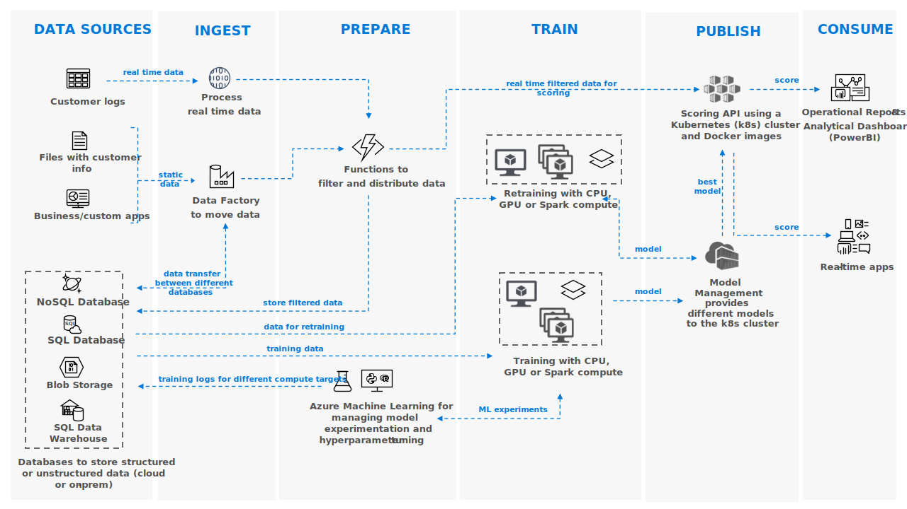

## AI Projects

This repository contains AI projects spanning multiple areas of machine learning. Many of these projects have associated articles on the blog sciblog.

You can find a list of most of the posts I have made in this file.

## Featured Projects

### Introduction to Convolutional Neural Networks

In this project, we explain what a convolution is and how to compute a CNN using the MXNet deep learning library with the MNIST character recognition dataset. Read the blog entry here.

### Introduction to Transfer Learning

Using PyTorch, this project explains the basic methodologies of transfer learning (finetuning and freezing) and analyzes in which cases each method is preferable. Read the blog entry here.

### Cloud-Scale Text Classification With Convolutional Neural Networks

These notebooks demonstrate how to perform character-level convolutions for sentiment analysis using Char-CNN and VDCNN models. Read the blog entry here.

### Introduction to Data Generation

This notebook presents simple techniques to generate new data in images, text, and time series. Read the blog entry here.

### Introduction to Dimensionality Reduction with t-SNE

Using sklearn and CUDA, this project showcases an example of the t-SNE algorithm. A CNN generates high-dimensional features from images, which are then projected and visualized in a 2D space. Read the blog entry here.

### Introduction to Distributed Training with DeepSpeed

This project demonstrates how to use DeepSpeed to perform distributed training with PyTorch. Read the blog entry here.

### Introduction to Fraud Detection

A real-time fraud detection model is designed using LightGBM on GPU (also available on CPU). The model is then operationalized through an API using Flask and WebSockets. Read the blog entry here.

### Introduction to Machine Learning API

This notebook demonstrates how to create an image classification API. The system utilizes a pretrained CNN with the CNTK deep learning library. Flask is used to manage endpoint services, while CherryPy serves as the backend server. Read the blog entry here.

### Introduction to Recommendation Systems with Deep Autoencoders

An overview of recommendation systems is provided, along with the implementation of a recommendation API using a deep autoencoder with PyTorch and the Netflix dataset. Read the blog entry here.

### Introduction to Natural Language Processing with fastText

This project demonstrates text classification, sentiment analysis, and word embedding using the fastText library. Additionally, it includes a method for representing word embeddings in a reduced space using the t-SNE algorithm. Read the blog entry here.

### Time Series Forecasting of Stock Price

A simple stock forecasting model is implemented using different variants of LSTMs and Keras. Read the blog entry here.

### Visualization of Football Matches with Datashader

This notebook explains how to visualize all UEFA Champions League matches since its inception using the Python library Datashader. The Lean Startup method is applied to create this project. Read the blog entry here.

### Machine Learning Reference Architecture

This repository serves as a reference for various machine learning architectures and implementations, covering different use cases and techniques in AI and deep learning.

## ScreenShots

